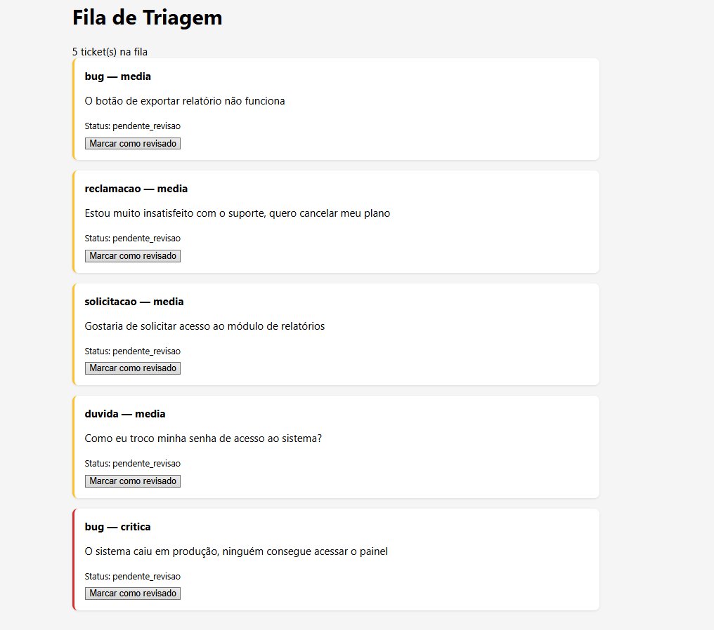
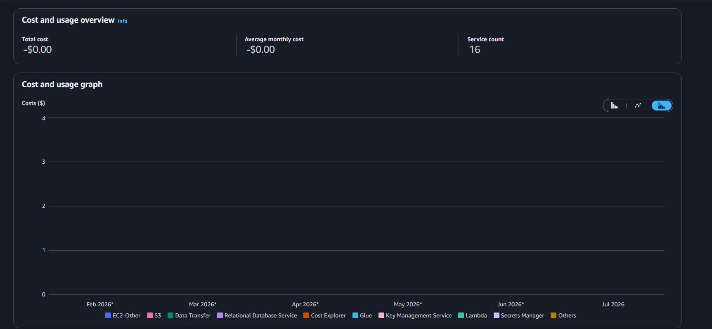
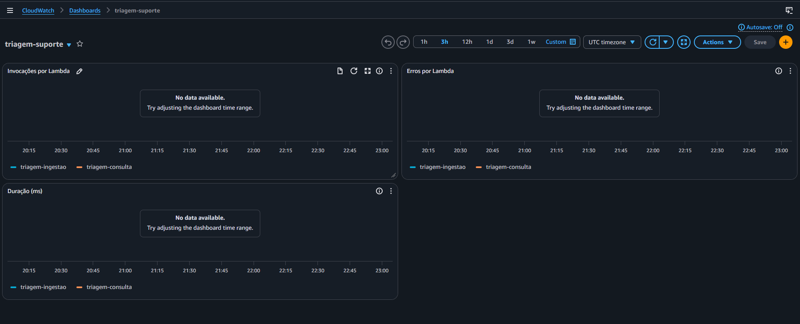

# Sistema de Triagem de Suporte

Pipeline serverless que recebe tickets de suporte, classifica automaticamente
urgência e categoria, armazena os chamados no Amazon S3 e expõe uma fila para
revisão humana por meio de um dashboard estático.

## Arquitetura

```text
Internet
│
▼
API Gateway
│
├──► Lambda "ingestao" (stateless)
│      ├──► Classificador (regras por palavras-chave)
│      └──► S3: tickets/{id}.json
│
└──► Lambda "consulta" (stateless)
       └──► lê S3, devolve fila em JSON
│
▼
Site estático (S3) exibindo a fila

CloudWatch monitora as duas Lambdas
Budget + alarme de custo ativos desde o início
```

## Por que serverless (sem EC2, sem RDS)

Decisão documentada em
[DECISAO_ARQUITETURA.md](./DECISAO_ARQUITETURA.md).

Resumo: recursos "always-on" (servidor, banco relacional) cobram por hora
rodando, independente de uso — risco real de custo esquecido. Trocando por
Lambda + S3, o sistema só cobra por execução, e o free tier cobre
folgadamente o volume de um projeto de portfólio.

## Classificação de tickets

A classificação de categoria e urgência é feita por correspondência de
palavras-chave (`src/ingestao/classificador.py`), não por chamada a um
LLM. Essa decisão está documentada em
[DECISAO_ARQUITETURA.md](./DECISAO_ARQUITETURA.md) — resumindo: API de
LLM tem custo por token fora do free tier da AWS, incompatível com o
orçamento deste projeto. A função mantém a mesma assinatura que uma
implementação via LLM teria, permitindo substituição futura sem alterar
o resto do sistema.

## Stack

* **AWS Lambda** — ingestão e consulta, ambas stateless
* **API Gateway** — exposição HTTP das Lambdas
* **Amazon S3** — armazenamento de tickets (JSON) e hospedagem do dashboard estático
* **CloudWatch** — logs, métricas e alarmes de erro e duração
* **Amazon SNS** — envio de notificações dos alarmes
* **AWS Budgets** — monitoramento e alerta de custos

## Estrutura do projeto

```text
src/        código das Lambdas
site/       dashboard estático (HTML/JS)
infra/      scripts de provisionamento AWS (IAM, S3, Budget, deploy)
scripts/    utilitários (verificação de ambiente)
tests/      testes unitários
```

## Como rodar localmente

1. Clone o repositório e crie o ambiente virtual:

```powershell
python -m venv .venv
.venv\Scripts\Activate.ps1
pip install -r requirements.txt
```

2. Copie `.env.example` para `.env` e preencha as configurações necessárias:

```powershell
copy .env.example .env
```

3. Execute a verificação do ambiente:

```powershell
python scripts/verificar_ambiente.py
```

## Deploy

```powershell
python infra/criar_role_lambdas.py
python infra/criar_bucket.py
python infra/criar_budget.py
python infra/deploy_lambdas.py
```

## Testes

```powershell
python -m pytest tests/
```

## Acessando o dashboard

http://triagem-suporte-ivan.s3-website-sa-east-1.amazonaws.com/site/

## Screenshots

### Dashboard de triagem


### Custo real (Cost Explorer, filtrado por tag do projeto)


### Métricas CloudWatch


## Status do projeto

✅ Concluído — projeto de portfólio, mês 6 do roadmap de engenharia de
software (AWS/Cloud). Pipeline serverless completo: ingestão, 
classificação, armazenamento, consulta, dashboard, observabilidade e
alarmes de custo, com custo real de $0 dentro do free tier AWS.
